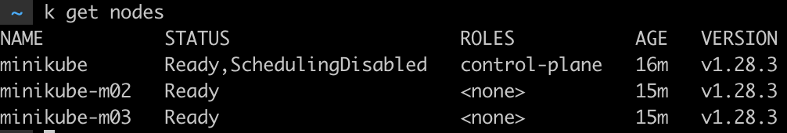
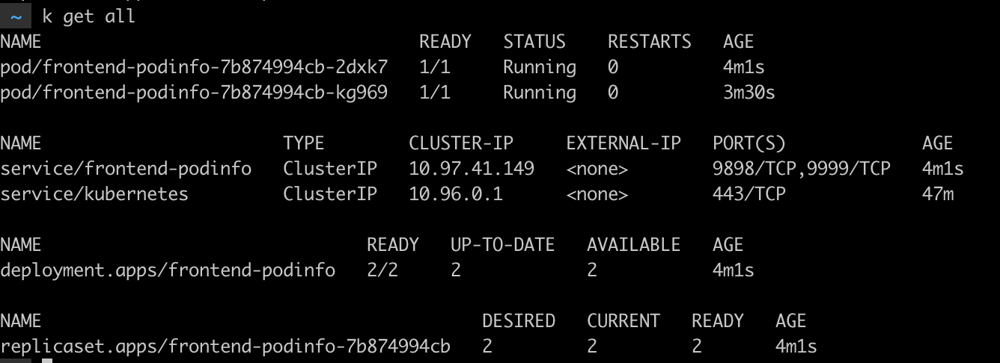
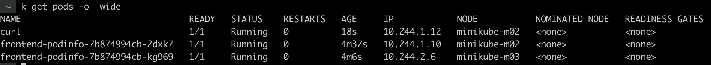
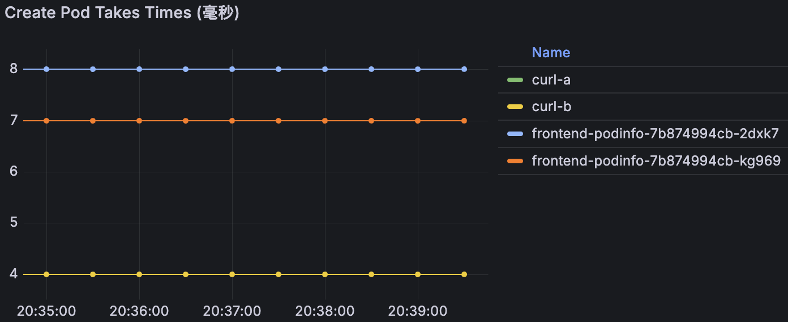
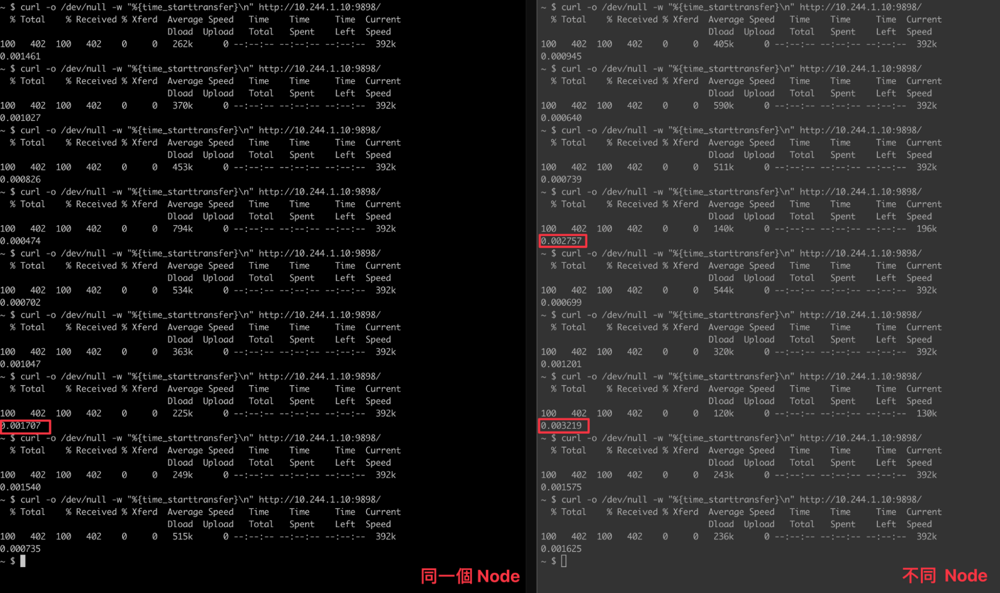
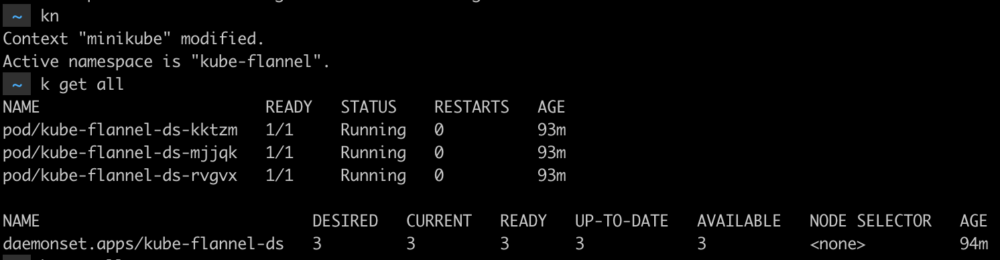
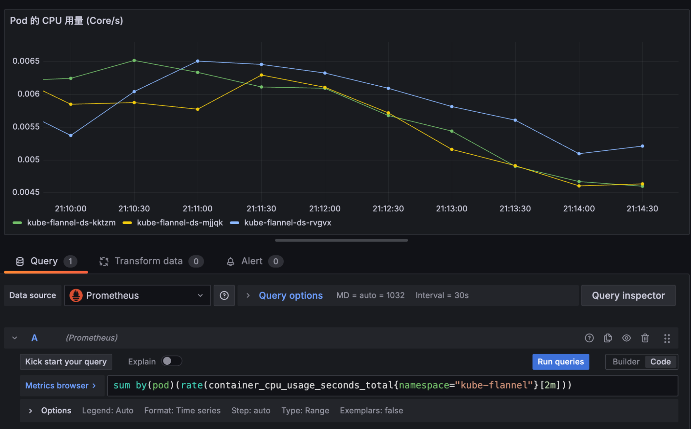
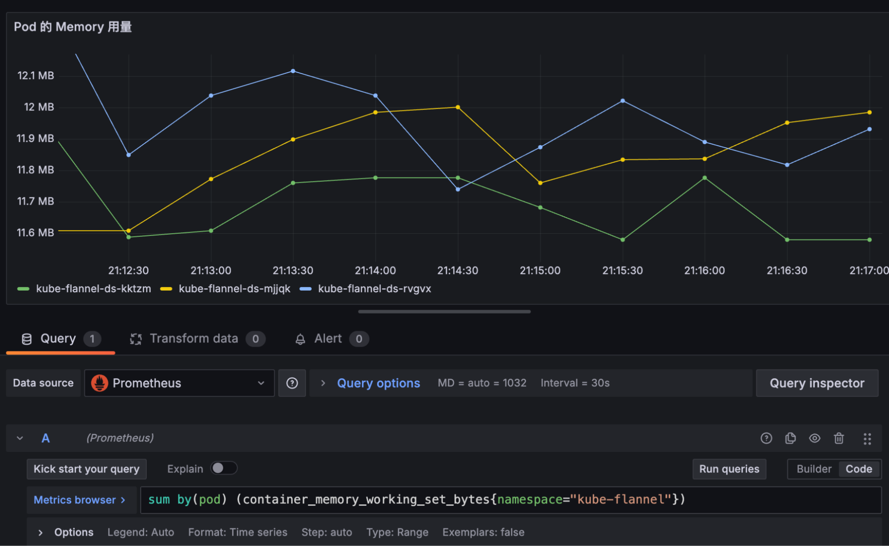

# CNI Lab

## 使用 Minikube

建立 1 個 Control Plane，和兩個 WorkerNode，使用的 CNI 是 flannel

```
minikube start --memory=8192 --cni=flannel --nodes 3
```

先把 Control Plane Cordon，讓 Pod 不會被部署在上面



## 監控部署

使用 Prometheus-stack 進行監控

```
helm repo add prometheus-community https://prometheus-community.github.io/helm-charts

helm repo update

# 部署

helm install cni-lab prometheus-community/kube-prometheus-stack --namespace monitoring --create-namespace

```

### 兩個 Node 各部署一個 curl 和 一個 Podinfo

在 default 的 namespace

```
# 先建立 node 的標籤，方便後面讓 Pod 長在指定的 Node 的上

kubectl label nodes minikube-m02 node=A

kubectl label nodes minikube-m03 node=B

```

[Podinfo](https://www.google.com/url?q=https://github.com/stefanprodan/podinfo&sa=D&source=editors&ust=1712674545987500&usg=AOvVaw3N2B6-wND5BSkB1052p_iB)，replicaCount 設定 2 個，會剛好一個 Node 長一個

```
helm repo add podinfo https://stefanprodan.github.io/podinfo

helm upgrade --install --wait frontend \
--set replicaCount=2 \
--set backend=http://backend-podinfo:9898/echo \
podinfo/podinfo

```



先用 `k get pod -o wide` 看 Podinfo 建立 Pod 的 IP 和他們所在的 Node 名稱

測試用的 curl，以 Node-A 的 Curl 爲例

```
kubectl run --restart=Never --rm -it curl --image curlimages/curl --overrides='{"apiVersion": "v1", "spec": {"nodeSelector": {"node": "A"}}}' -- sh
```

用 ab 測試的方式

```
# 使用 ubuntu 的 image
kubectl run --restart=Never --rm -it ab-a --image ubuntu --overrides='{"apiVersion": "v1", "spec": {"nodeSelector": {"node": "A"}}}' -- sh

# 進入後 
apt-get update && install apache2-utils
ab -n 10000 http:// 要測試 PodIP：9898/
```



```
# Curl Pod 的 IP，可以看到資料
~ $ curl 10.244.1.10:9898
{
  "hostname": "frontend-podinfo-7b874994cb-2dxk7",
  "version": "6.6.1",
  "revision": "d042732a4459b09915e64edb1ca804be2f8074af",
  "color": "#34577c",
  "logo": "https://raw.githubusercontent.com/stefanprodan/podinfo/gh-pages/cuddle_clap.gif",
  "message": "greetings from podinfo v6.6.1",
  "goos": "linux",
  "goarch": "arm64",
  "runtime": "go1.22.1",
  "num_goroutine": "8",
  "num_cpu": "10"
}

```

## 觀察項目

### Pod 的建立所花費的時間，單位是毫秒

```
sum by (pod) (kube_pod_status_ready_time{namespace="default"})
-
sum by (pod) (kube_pod_created{namespace="default"})

# Metrics 說明
kube_pod_status_ready_time ： Time when pod passed readiness probes.
kube_pod_created ： Pod 被建立的時間

```



### 回覆時間

使用 curl 的指令可以查看回覆的時間，

```
curl -o /dev/null -w "%{time_starttransfer}\n" http://10.244.1.10:9898/

```
因爲都在同一個網路內，延時都很少，可能要在外部網路才會比較有感覺

使用平均時間來看，不同 Node 的延時還是會比較高一點



### CNI 對於 Node 的 Loading

#### 現況



#### CPU



```
sum by(pod)(rate(container_cpu_usage_seconds_total{namespace="kube-flannel"}[2m]))
```

#### 記憶體



```
sum by(pod) (container_memory_working_set_bytes{namespace="CNI 的 Namespace ", pod=~"關鍵字.*"}) 
```