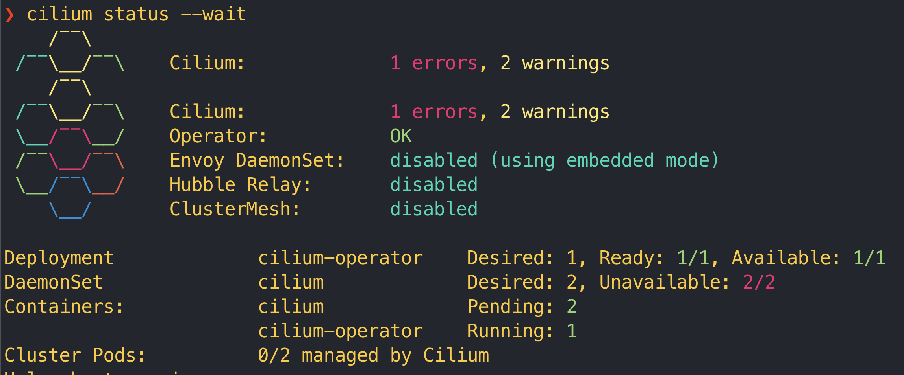
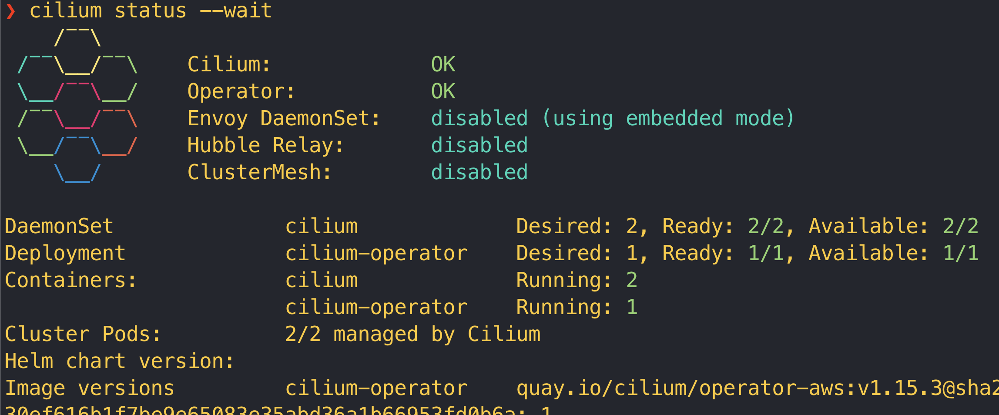
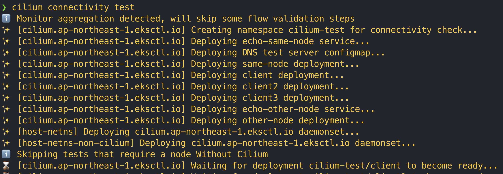
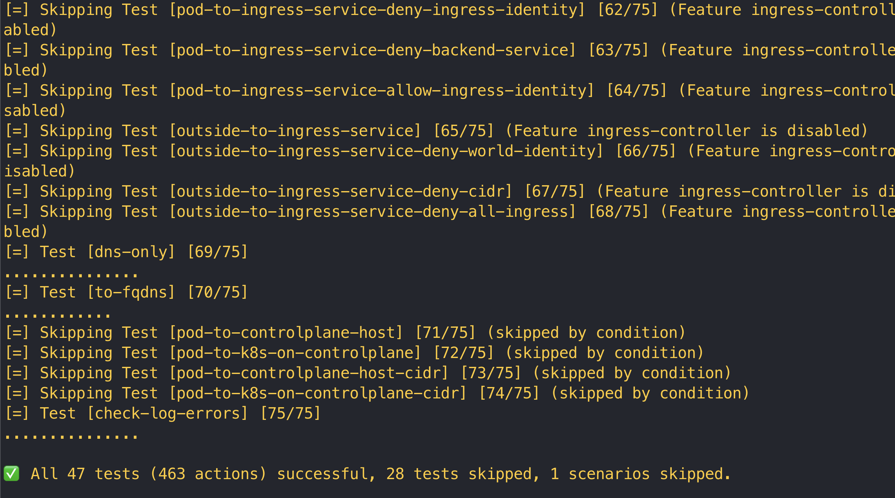
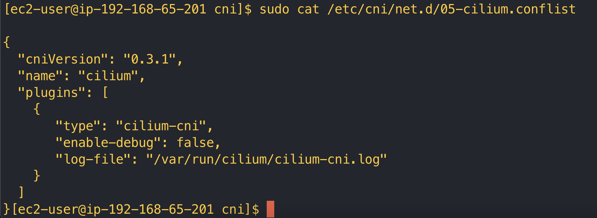
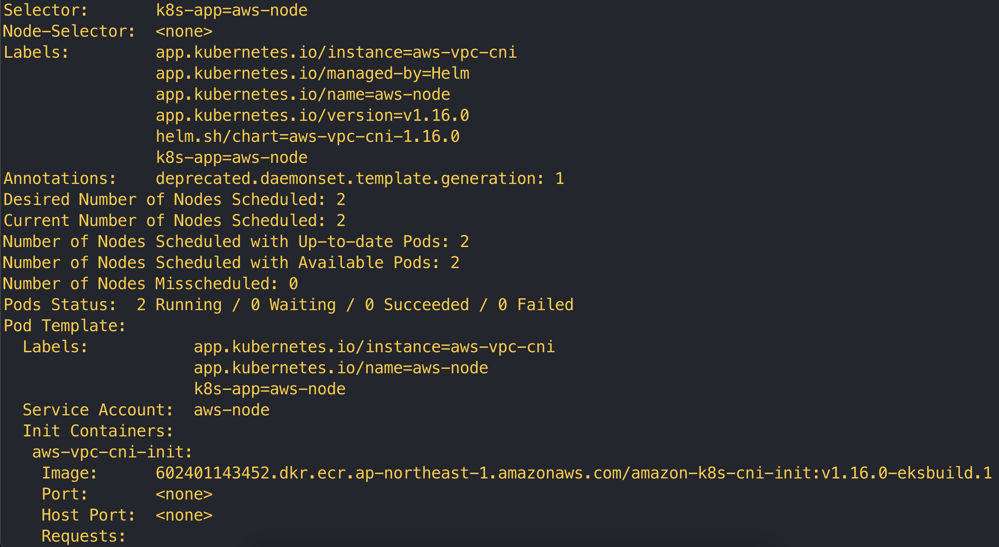

# 在 eks 安裝 cilium

建立 EKS cluster config yaml

`cluster.yaml`

```jsx
apiVersion: eksctl.io/v1alpha5
kind: ClusterConfig

metadata:
  name: basic-cluster
  region: ap-northeast-1

nodeGroups:
  - name: ng-1
    instanceType: m5.large
    desiredCapacity: 10
    volumeSize: 80
    ssh:
      allow: true
  - name: ng-2
    instanceType: m5.xlarge
    desiredCapacity: 2
    volumeSize: 100

```

建立 EKS cluster

```jsx
eksctl create cluster -f ./cluster.yaml
```

不要用官方建議的安裝方式，直接用 brew 安裝

```jsx
brew install cilium-cli
```

確認 cilium 版號

```jsx
cilium install --version 1.15.3
```

cilium 會自動 detect EKS，可以輸入以下指令確認是否 ok，通常要等一下

```jsx
cilium status --wait
```

一開始會看到這樣



等一段時間後會變成



接著下 connect 測試

```jsx
cilium connectivity test
```



等他跑完，成功！



驗證

```jsx
sudo cat /etc/cni/net.d/05-cilium.conflist
```



查看原本 default aws cni

```jsx
kubectl describe daemonset aws-node --namespace kube-system
```



驗證

```shell
❯ kubectl get daemonset -n kube-system
NAME         DESIRED   CURRENT   READY   UP-TO-DATE   AVAILABLE   NODE SELECTOR                     AGE
aws-node     0         0         0       0            0           io.cilium/aws-node-enabled=true   20m
cilium       2         2         2       2            2           kubernetes.io/os=linux            5m33s
kube-proxy   2         2         2       2            2           <none>                            20m
❯ kubectl describe daemonset cilium --namespace kube-system
Name:           cilium
Selector:       k8s-app=cilium
Node-Selector:  kubernetes.io/os=linux
Labels:         app.kubernetes.io/managed-by=Helm
                app.kubernetes.io/name=cilium-agent
                app.kubernetes.io/part-of=cilium
                k8s-app=cilium
Annotations:    deprecated.daemonset.template.generation: 1
                meta.helm.sh/release-name: cilium
                meta.helm.sh/release-namespace: kube-system
Desired Number of Nodes Scheduled: 2
Current Number of Nodes Scheduled: 2
Number of Nodes Scheduled with Up-to-date Pods: 2
Number of Nodes Scheduled with Available Pods: 2
Number of Nodes Misscheduled: 0
Pods Status:  2 Running / 0 Waiting / 0 Succeeded / 0 Failed
Pod Template:
  Labels:           app.kubernetes.io/name=cilium-agent
                    app.kubernetes.io/part-of=cilium
                    k8s-app=cilium
  Annotations:      container.apparmor.security.beta.kubernetes.io/apply-sysctl-overwrites: unconfined
                    container.apparmor.security.beta.kubernetes.io/cilium-agent: unconfined
                    container.apparmor.security.beta.kubernetes.io/clean-cilium-state: unconfined
                    container.apparmor.security.beta.kubernetes.io/mount-cgroup: unconfined
  Service Account:  cilium
  Init Containers:
   config:
    Image:      quay.io/cilium/cilium:v1.15.3@sha256:da74ab61d1bc665c1c088dff41d5be388d252ca5800f30c7d88844e6b5e440b0
    Port:       <none>
    Host Port:  <none>
    Command:
      cilium-dbg
      build-config
    Environment:
      K8S_NODE_NAME:          (v1:spec.nodeName)
      CILIUM_K8S_NAMESPACE:   (v1:metadata.namespace)
    Mounts:
      /tmp from tmp (rw)
   mount-cgroup:
    Image:      quay.io/cilium/cilium:v1.15.3@sha256:da74ab61d1bc665c1c088dff41d5be388d252ca5800f30c7d88844e6b5e440b0
    Port:       <none>
    Host Port:  <none>
    Command:
      sh
      -ec
      cp /usr/bin/cilium-mount /hostbin/cilium-mount;
      nsenter --cgroup=/hostproc/1/ns/cgroup --mount=/hostproc/1/ns/mnt "${BIN_PATH}/cilium-mount" $CGROUP_ROOT;
      rm /hostbin/cilium-mount

    Environment:
      CGROUP_ROOT:  /run/cilium/cgroupv2
      BIN_PATH:     /opt/cni/bin
    Mounts:
      /hostbin from cni-path (rw)
      /hostproc from hostproc (rw)
   apply-sysctl-overwrites:
    Image:      quay.io/cilium/cilium:v1.15.3@sha256:da74ab61d1bc665c1c088dff41d5be388d252ca5800f30c7d88844e6b5e440b0
    Port:       <none>
    Host Port:  <none>
    Command:
      sh
      -ec
      cp /usr/bin/cilium-sysctlfix /hostbin/cilium-sysctlfix;
      nsenter --mount=/hostproc/1/ns/mnt "${BIN_PATH}/cilium-sysctlfix";
      rm /hostbin/cilium-sysctlfix

    Environment:
      BIN_PATH:  /opt/cni/bin
    Mounts:
      /hostbin from cni-path (rw)
      /hostproc from hostproc (rw)
   mount-bpf-fs:
    Image:      quay.io/cilium/cilium:v1.15.3@sha256:da74ab61d1bc665c1c088dff41d5be388d252ca5800f30c7d88844e6b5e440b0
    Port:       <none>
    Host Port:  <none>
    Command:
      /bin/bash
      -c
      --
    Args:
      mount | grep "/sys/fs/bpf type bpf" || mount -t bpf bpf /sys/fs/bpf
    Environment:  <none>
    Mounts:
      /sys/fs/bpf from bpf-maps (rw)
   clean-cilium-state:
    Image:      quay.io/cilium/cilium:v1.15.3@sha256:da74ab61d1bc665c1c088dff41d5be388d252ca5800f30c7d88844e6b5e440b0
    Port:       <none>
    Host Port:  <none>
    Command:
      /init-container.sh
    Environment:
      CILIUM_ALL_STATE:           <set to the key 'clean-cilium-state' of config map 'cilium-config'>         Optional: true
      CILIUM_BPF_STATE:           <set to the key 'clean-cilium-bpf-state' of config map 'cilium-config'>     Optional: true
      WRITE_CNI_CONF_WHEN_READY:  <set to the key 'write-cni-conf-when-ready' of config map 'cilium-config'>  Optional: true
    Mounts:
      /run/cilium/cgroupv2 from cilium-cgroup (rw)
      /sys/fs/bpf from bpf-maps (rw)
      /var/run/cilium from cilium-run (rw)
   install-cni-binaries:
    Image:      quay.io/cilium/cilium:v1.15.3@sha256:da74ab61d1bc665c1c088dff41d5be388d252ca5800f30c7d88844e6b5e440b0
    Port:       <none>
    Host Port:  <none>
    Command:
      /install-plugin.sh
    Requests:
      cpu:        100m
      memory:     10Mi
    Environment:  <none>
    Mounts:
      /host/opt/cni/bin from cni-path (rw)
  Containers:
   cilium-agent:
    Image:      quay.io/cilium/cilium:v1.15.3@sha256:da74ab61d1bc665c1c088dff41d5be388d252ca5800f30c7d88844e6b5e440b0
    Port:       <none>
    Host Port:  <none>
    Command:
      cilium-agent
    Args:
      --config-dir=/tmp/cilium/config-map
    Liveness:   http-get http://127.0.0.1:9879/healthz delay=0s timeout=5s period=30s #success=1 #failure=10
    Readiness:  http-get http://127.0.0.1:9879/healthz delay=0s timeout=5s period=30s #success=1 #failure=3
    Startup:    http-get http://127.0.0.1:9879/healthz delay=5s timeout=1s period=2s #success=1 #failure=105
    Environment:
      K8S_NODE_NAME:               (v1:spec.nodeName)
      CILIUM_K8S_NAMESPACE:        (v1:metadata.namespace)
      CILIUM_CLUSTERMESH_CONFIG:  /var/lib/cilium/clustermesh/
      GOMEMLIMIT:                 node allocatable (limits.memory)
    Mounts:
      /host/etc/cni/net.d from etc-cni-netd (rw)
      /host/proc/sys/kernel from host-proc-sys-kernel (rw)
      /host/proc/sys/net from host-proc-sys-net (rw)
      /lib/modules from lib-modules (ro)
      /run/xtables.lock from xtables-lock (rw)
      /sys/fs/bpf from bpf-maps (rw)
      /tmp from tmp (rw)
      /var/lib/cilium/clustermesh from clustermesh-secrets (ro)
      /var/lib/cilium/tls/hubble from hubble-tls (ro)
      /var/run/cilium from cilium-run (rw)
  Volumes:
   tmp:
    Type:       EmptyDir (a temporary directory that shares a pod's lifetime)
    Medium:
    SizeLimit:  <unset>
   cilium-run:
    Type:          HostPath (bare host directory volume)
    Path:          /var/run/cilium
    HostPathType:  DirectoryOrCreate
   bpf-maps:
    Type:          HostPath (bare host directory volume)
    Path:          /sys/fs/bpf
    HostPathType:  DirectoryOrCreate
   hostproc:
    Type:          HostPath (bare host directory volume)
    Path:          /proc
    HostPathType:  Directory
   cilium-cgroup:
    Type:          HostPath (bare host directory volume)
    Path:          /run/cilium/cgroupv2
    HostPathType:  DirectoryOrCreate
   cni-path:
    Type:          HostPath (bare host directory volume)
    Path:          /opt/cni/bin
    HostPathType:  DirectoryOrCreate
   etc-cni-netd:
    Type:          HostPath (bare host directory volume)
    Path:          /etc/cni/net.d
    HostPathType:  DirectoryOrCreate
   lib-modules:
    Type:          HostPath (bare host directory volume)
    Path:          /lib/modules
    HostPathType:
   xtables-lock:
    Type:          HostPath (bare host directory volume)
    Path:          /run/xtables.lock
    HostPathType:  FileOrCreate
   clustermesh-secrets:
    Type:                Projected (a volume that contains injected data from multiple sources)
    SecretName:          cilium-clustermesh
    SecretOptionalName:  0x14000694958
    SecretName:          clustermesh-apiserver-remote-cert
    SecretOptionalName:  0x140006949de
   host-proc-sys-net:
    Type:          HostPath (bare host directory volume)
    Path:          /proc/sys/net
    HostPathType:  Directory
   host-proc-sys-kernel:
    Type:          HostPath (bare host directory volume)
    Path:          /proc/sys/kernel
    HostPathType:  Directory
   hubble-tls:
    Type:                Projected (a volume that contains injected data from multiple sources)
    SecretName:          hubble-server-certs
    SecretOptionalName:  0x14000694a6d
  Priority Class Name:   system-node-critical
Events:
  Type    Reason            Age   From                  Message
  ----    ------            ----  ----                  -------
  Normal  SuccessfulCreate  6m1s  daemonset-controller  Created pod: cilium-q56b8
  Normal  SuccessfulCreate  6m    daemonset-controller  Created pod: cilium-9k68k
```

[Cilium Quick Installation — Cilium 1.15.3 documentation](https://docs.cilium.io/en/stable/gettingstarted/k8s-install-default/#k8s-install-quick)