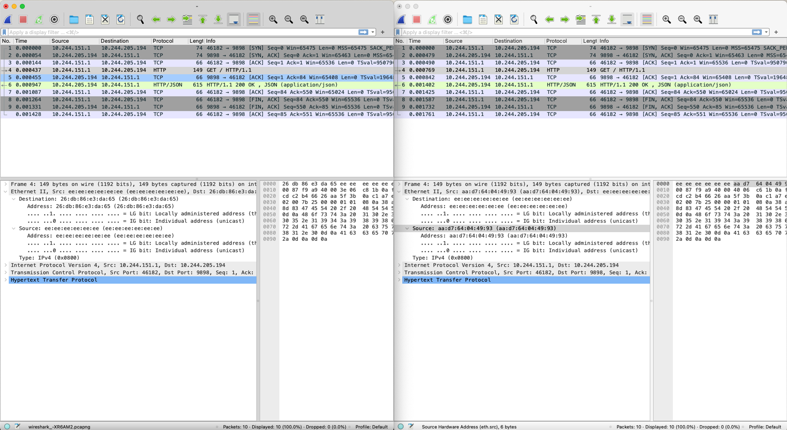
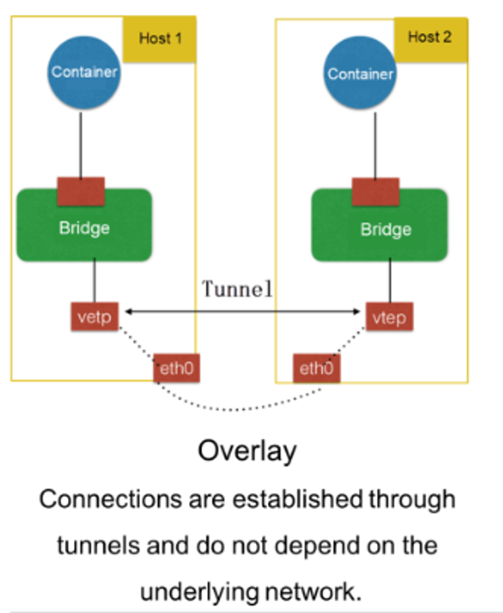
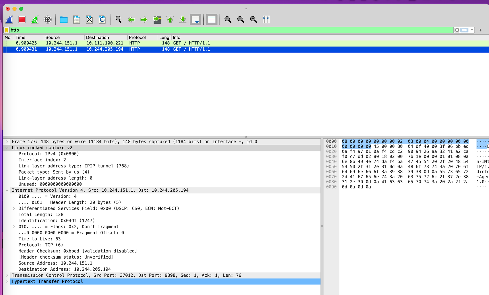

# [CNI] Minikube Calico Live Demo

### Minikube Start

```
minikube start --nodes 3 --cni calico
```

### Label nodes

```
kubectl label nodes minikube-m03 serviceType=service-03
kubectl label nodes minikube-m02 serviceType=service-02
```

### Setup client (ubuntu image with `tcpdump` and `curl` on each node)

```
kubectl apply -f - <<EOF
apiVersion: v1
kind: Pod
metadata:
  name: ubuntu-02
spec:
  containers:
    - name: ubuntu
      image: ubuntu
      args:
        - /bin/sh
        - -c
        - |
          apt update
          apt install -y tcpdump curl iputils-ping
          while true; do sleep 3600; done
  affinity:
    nodeAffinity:
      requiredDuringSchedulingIgnoredDuringExecution:
        nodeSelectorTerms:
          - matchExpressions:
              - key: serviceType
                operator: In
                values:
                  - service-02
---
apiVersion: v1
kind: Pod
metadata:
  name: ubuntu-03
spec:
  containers:
    - name: ubuntu
      image: ubuntu
      args:
        - /bin/sh
        - -c
        - |
          apt update
          apt install -y tcpdump curl iputils-ping
          while true; do sleep 3600; done
  affinity:
    nodeAffinity:
      requiredDuringSchedulingIgnoredDuringExecution:
        nodeSelectorTerms:
          - matchExpressions:
              - key: serviceType
                operator: In
                values:
                  - service-03
EOF
```

### Setup server (`podinfo` server with service)

```
helm repo add podinfohttps://stefanprodan.github.io/podinfo

helm upgrade --install --wait podinfo podinfo/podinfo -f - <<EOF
affinity:
  nodeAffinity:
    requiredDuringSchedulingIgnoredDuringExecution:
      nodeSelectorTerms:
        - matchExpressions:
            - key: serviceType
              operator: In
              values:
                - service-02
service:
  type: NodePort
EOF
```

### Install `tcpdump` on nodes

```
docker exec minikube-m02 sh -c "apt update && apt install -y tcpdump" &
docker exec minikube-m03 sh -c "apt update && apt install -y tcpdump"
```

### Get pod/Podinfo IP

```
POD_IP=$(kubectl get pods -l "app.kubernetes.io/name=podinfo" -o jsonpath='{.items[*].status.podIP}')
```

## Lab 1 (Cross Node Request to target pod IP)

### Terminal 1

- Start Recording from `node-3`
    - Explain `tcpdump -pne -i any -U -s0 -w - | wireshark -k -i -`
        
        • `tcpdump` is a command-line packet analyzer that captures
        
        network traffic.
        
        • `-p` disables promiscuous mode.
        
        • `-n` displays IP addresses and port numbers instead of
        
        resolving them to hostnames and service names.
        
        • `-e` includes the link-level header information in the
        
        output.
        
        • `-i any` captures packets from any network interface.
        
        • `-U` writes packets to the output file immediately, instead
        
        of buffering them.
        
        • `-s0` captures the entire packet without truncation.
        
        • `-w -` writes the captured packets to standard output.
        
        • `|` is the pipe operator, which redirects the output of the
        
        previous command to the input of the next command.
        
        • `wireshark` is a graphical network protocol analyzer that
        
        allows you to analyze captured network traffic.
        
        • `-k` starts capturing packets immediately.
        
        • `-i -` reads the captured packets from standard input.
        
    
    ```
    docker exec -i minikube-m03 tcpdump -pne -i any -U -s0 -w -  | wireshark -k -i -
    ```
    

### Terminal 2

- Send request from `node-3` to `podinfo` in `node-2`
    
    ```
    kubectl exec -i pod/ubuntu-03 -- curl $POD_IP:9898
    ```
    

### Expected Result

- Packets between pods on nodes in different subnets are encapsulated using **IPIP**, wrapping each original packet in an outer packet that uses node IPs, and hiding the pod IPs of the inner packet. This can be done very efficiently by the Linux kernel, but it still represents a small overhead compared to non-overlay traffic.
- Linux cooked capture is `pseudo-protocol` used by libpcap


---

## Lab 2 (See the overlay tunnel)

<aside>
💡 每建立一個新的 pod ， CNI 會在 Node 上面建立一個虛擬網卡

</aside>

### Terminal 1

- Get `calico` interface `cali*` from `node-2`
    
    ```
    docker exec -i minikube-m02 ip link show | grep cali
    ```
    
- Start Recording from `node-2` with calico interface
    
    ```
    docker exec -i minikube-m02 tcpdump -pne -i cali* -U -s0 -w -  | wireshark -k -i -
    ```
    

### Terminal 2

- Get `calico` interface `cali*` from `node-3`
    
    ```
    docker exec -i minikube-m03 ip link show | grep cali
    ```
    
- Start Recording from `node-3` with calico interface
    
    ```
    docker exec -i minikube-m03 tcpdump -pne -i cali* -U -s0 -w -  | wireshark -k -i -
    ```
    

### Terminal 3

- Send request from `node-3` to `podinfo` service in `node-2`
    
    ```
    kubectl exec -i pod/ubuntu-03 -- curl $POD_IP:9898
    ```
    

### Expected Result

- Packet through calico tunnel instead of `eth0`





---

## Lab 3 (Cross Node Request to target service)

### Terminal 1

- Start Recording from `node-3`
    
    ```
    docker exec -i minikube-m03 tcpdump -pne -i any -U -s0 -w -  | wireshark -k -i -
    ```
    

### Terminal 2

- Send request from `node-3` to `podinfo` service in `node-2`
    
    ```
    kubectl exec -i pod/ubuntu-03 -- curl podinfo:9898
    ```
    

### Expected Result

- 被透過 `kube-proxy` DNAT 的封包，可以看到 `Linux cooked capture` 內並沒有 source 的 mac address
    
    
    
    - `cilium` 並不會有這個現象，因為其採用 eBPF